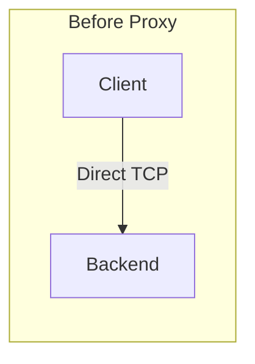
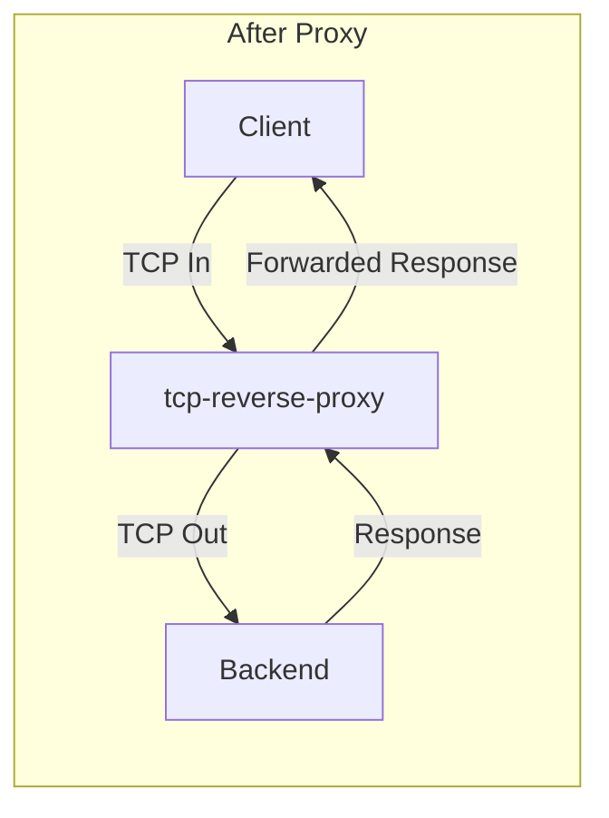

# tcp-reverse-proxy

Configurable Layer 4 TCP reverse proxy for tunneling HTTPS/TCP traffic between clients and an upstream target. Ships as both a CLI (`tcp-reverse-proxy`) and a programmatic API so you can embed it into other tooling.

## Table of Contents

- [Installation](#installation)
- [Usage](#usage)
- [How Proxy Flow Works](#how-proxy-flow-works)
- [License](#license)

## Installation

Install from npm:

```bash
npm install tcp-reverse-proxy
```

Run with CLI:

```bash
npx tcp-reverse-proxy --help
```


## Usage

### CLI

Configuration can be supplied either as CLI flags or environment variables (CLI flags win when both are provided). The CLI always requires a backend host.

Example using only CLI flags:

```bash
tcp-reverse-proxy \
  --backend-host 192.168.131.170 \
  --backend-port 5015 \
  --frontend-port 8443 \
  --listen-host 0.0.0.0
```

Example with response delay:

```bash
BACKEND_HOST=192.168.131.170 \
BACKEND_PORT=5015 \
FRONTEND_PORT=8443 \
RESPONSE_DELAY_MS=3000 \
tcp-reverse-proxy
```

Example development runs with `ts-node`:

```bash
npx ts-node src/app.ts \
  --backend-host 192.168.131.170 \
  --backend-port 5015 \
  --frontend-port 8443 \
  --listen-host 0.0.0.0
```

With response delay:

```bash
npx ts-node src/app.ts \
  --backend-host 192.168.1.123 \
  --backend-port 5015 \
  --response-delay 2000
```

Available CLI flags:

| Flag | Description |
| ---- | ----------- |
| `-H, --backend-host <host>` | Target host/IP to forward traffic to (required) |
| `-P, --backend-port <port>` | Target port on the backend host (default: `FRONTEND_PORT`) |
| `-F, --frontend-port <port>` | Local listening port (default: `5015`) |
| `-L, --listen-host <host>` | Host/IP to bind to (default: auto-detected local IPv4) |
| `-X, --local-ip-prefix <prefix>` | Prefix used when auto-detecting the local IPv4 (default: `192.`) |
| `-D, --response-delay <ms>` | Delay response to client by milliseconds (default: `0`) |
| `-h, --help` | Show inline help and exit |

Available environment variables:

| Variable | Required | Default | Description |
| -------- | -------- | ------- | ----------- |
| `BACKEND_HOST` | yes | – | Target host or IP to forward traffic to |
| `BACKEND_PORT` | no | `FRONTEND_PORT` | Target port on the backend host |
| `FRONTEND_PORT` | no | `5015` | Local listening port |
| `LISTEN_HOST` | no | auto-detected local IPv4 | Hostname/IP to bind the listener |
| `LOCAL_IP_PREFIX` | no | `192.` | Prefix used when auto-detecting local IPv4 |
| `RESPONSE_DELAY_MS` | no | `0` | Delay response to client by milliseconds |

### Programmatic API

```ts
import { startProxy } from 'tcp-reverse-proxy';

const server = startProxy({
  frontendPort: 8443,
  backendHost: '192.168.131.170',
  backendPort: 5015,
  responseDelayMs: 2000, // Optional: delay responses by 2 seconds
});

server.on('listening', () => console.log('Proxy ready!'));
```

## How Proxy Flow Works





Example setup:

- Backend service: `192.168.131.170:5015`
- Proxy listener: `0.0.0.0:8443`
- Client now connects to: `<proxy-host>:8443`

What happens:

1. Client opens a socket to the proxy listener.
2. Proxy opens a socket to the backend.
3. Client bytes are forwarded to backend.
4. Backend bytes are forwarded back to client.
5. Proxy logs connection events and data flow on both directions.

Example logs you can see in the proxy:

```text
[2026-03-28T21:12:01.202Z] L4 reverse proxy running on 0.0.0.0:8443, forwarding to 192.168.131.170:5015
New connection from 10.0.0.25:60344
Forwarding connection to 192.168.131.170:5015
[2026-03-28T21:12:08.901Z] Data from client: GET /health HTTP/1.1
[2026-03-28T21:12:08.908Z] Data from backend: HTTP/1.1 200 OK
[2026-03-28T21:12:08.909Z] Data sent to client without delay: HTTP/1.1 200 OK
[2026-03-28T21:12:08.909Z] requestCounter: 1
[2026-03-28T21:12:09.154Z] Client disconnected
```

If you start the proxy with `--response-delay 2000`, you will see `Data sent to client after 2000ms delay: ...` in logs.


## License

This project is licensed under the MIT License.